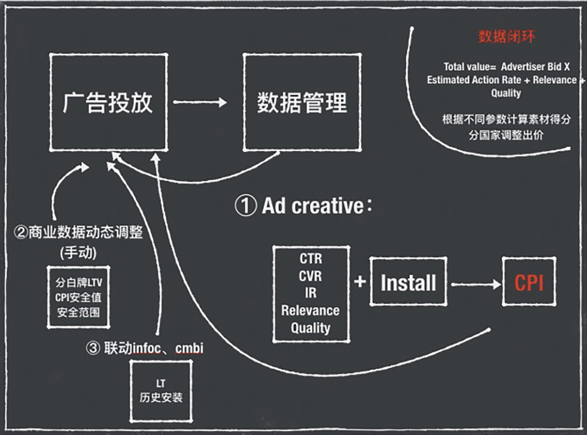
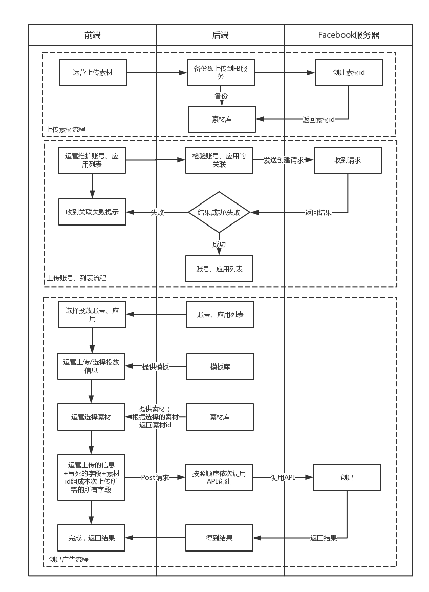
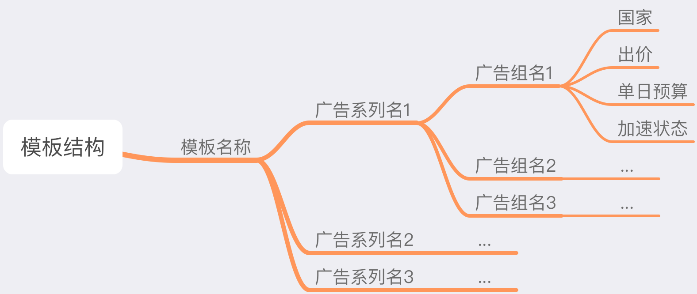
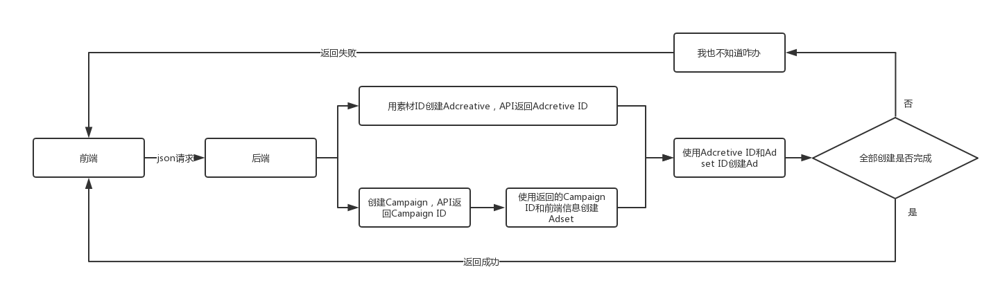
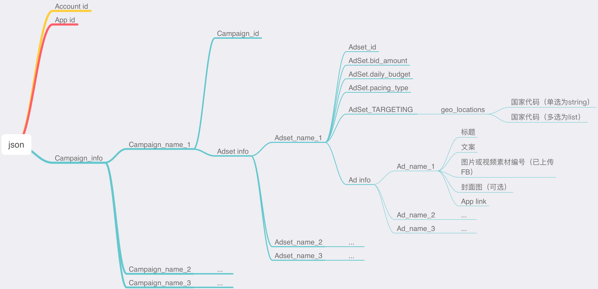
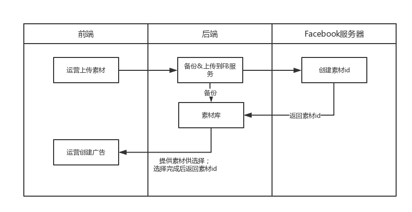
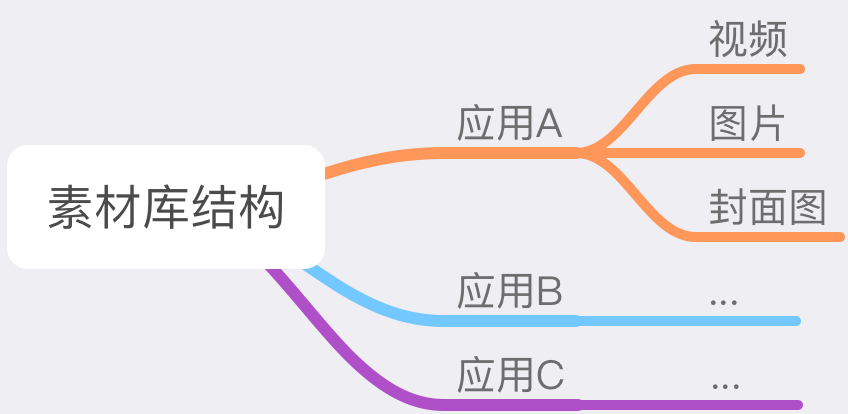
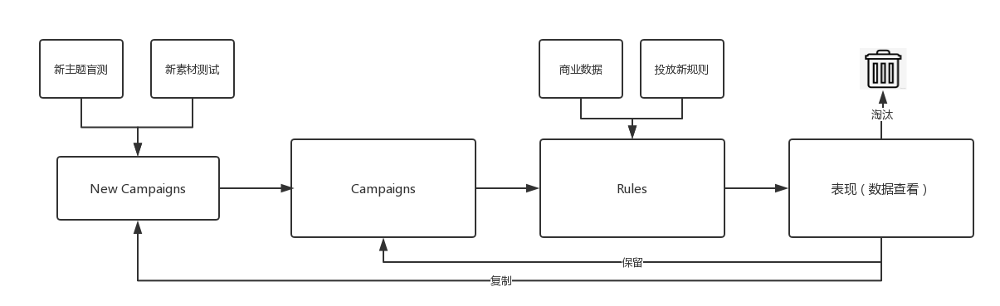
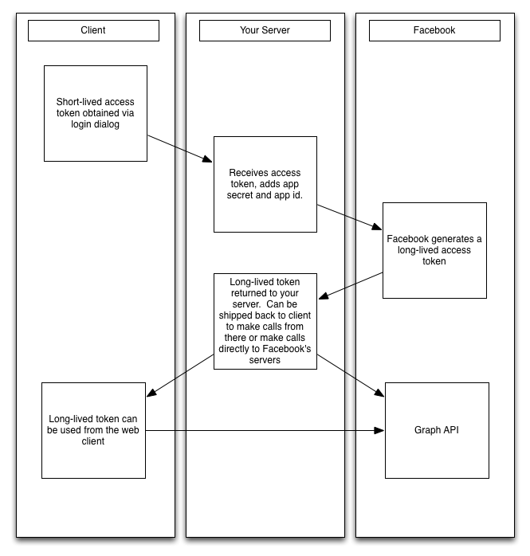
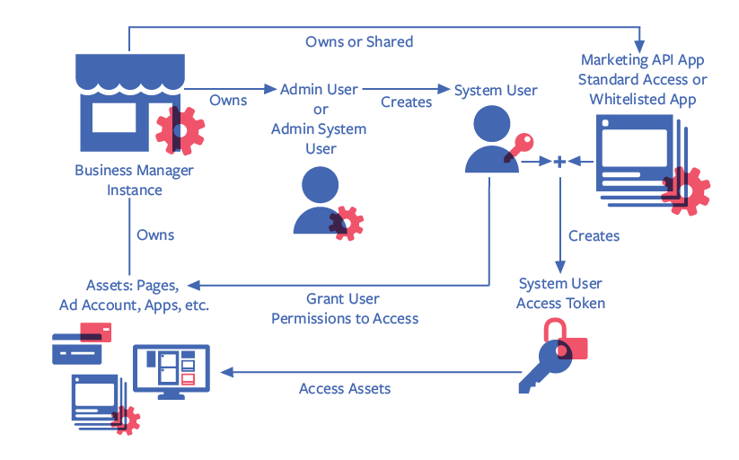

# Facebook广告投放自动化需求1.0（阿童木）

## 目录

[TOC]

## 项目概述

### 需求背景

在日常的投放中发现并Facebook的人确认过后，确定在FB投放的每个广告和素材都能拿到一定的基础展示，所以想用自动化的手段来增加素材、广告的数量级，目的是增加投放展示。

Facebook 营销API中提供了很多接口可以解决目前投放中遇到的问题（如批量创建、数据管理等）、提高投放的效率（自动投放），所以需要一个后台系统来调用API。

#### 项目目标

成本可控的情况下，通过自动化提高广告投放的数量，获得更多的展示

### 规划和进度

#### 系统规划




- 投放自动化流程

1. 多渠道素材采集
2. 批量创建广告
3. 根据情况、算法实时调整出价
4. 数据管理、查看投放效果


#### 进度

- **第一期：（8月初上线）**

新主题盲测批量创建

> 目前进度：开发中，前端已完成，后端未开始

- **第二期：（8月中旬）**

新主题自动化投放，应用rule，接入商业LTV数据，数据查看

> 目前进度：正在整理规则，商业LTV数据接口需求已提

- **第二期：（8月底）**

接入CM design接口、图片拼接

素材生产自动化，扩大素材数量级

> 目前进度：—


## 功能需求

### 创建

#### 批量创建（一期功能）

##### 功能背景

1.提高投放效率

因为Launcher是以主题为单位来进行投放的，每周都会有新主题进行投放。而在一个新主题的投放工作里，最为繁琐重复的就是创建广告功能。所以需要批量上传工具来提升运营投放效率。

2.跑通自动化投放流程

投放自动化需求中，最基本的需求就是利用API进行广告的创建，后期会有各种不同场景的自动创建广告需求，所以首先需要验证的就是创建功能。


- 解决思路

在Ad这一级，通过选择素材的数量直接决定广告的数量，减去Ad这一级之后，需要提供信息就只有Campaign和Adset层级。而投放信息通过将部分字段写死，另外一部分字段通过模板复用，从而减少了投放信息的维护。


##### 流程图



##### 原型图

原型图在需求文档根目录中


##### 前端需求

1.批量创建功能界面

2.素材库

3.账号、应用维护界面


##### 后端需求

1.创建广告接口

后端接收到来自前端的json请求后解析，将信息分为四类（Campaign,Adset,Ad,Adcreative)，并且按照顺序上传创建广告。

> 预留点
> - 能接收创建各层级（Campaign到Adcreative层级）的单独创建请求的接口。
> - 能向已有的Campaign中创建广告组、广告（如果前端返回了Campaign id这个字段，就在对应的Campaign中创建。


2.素材库的建立；前端上传完素材后，需要将素材上传到Facebook服务器，并将返回的素材id和文件一一对应。

> 预留点
>
> - 这次的素材库只有一级结构，是通过文件名前缀的来实现二级结构的，之后可能会增加素材库的层级。


3.拉取广告账户、应用列表的接口

> 预留点
>
> - BM平台的Admin权限下来之后，广告账户和应用的拉取，将实时通过Facebook API来完成
> - 这个功能放在最后做，这两周之内我会尽量申请到权限


4.测试广告账户、应用是否有关联的接口

> 预留点
>
> - 关联关系可能会在之后的拉取数据功能中用到，所以需要找个地方存起来。

5.投放信息模板拉取


##### 基本信息

维护上传所需的基本信息。


###### 选择广告账户、应用

选择本次创建要使用的广告账户，以及关联的应用。

选择广告账户，选择账户后后端返回与广告账户关联的应用。


###### 创建名称

由运营创建时手动输入，作为正式上传名称的一部分字符串，后面选择投放信息应用模板时在前端合成正式名称。

合成规则在【名称组成规则】中详叙。


##### 投放信息

投放信息以模板形式上传，运营在在前端填写完模板后，储存在后端，每个用户的模板是独立储存的。

每次批量创建都可以选择之前填写的模板，需要前端提供一个删除模板的入口，新增模板的入口在选择模板的边上。


###### 新建模板

- 模板名称

手动输入模板名称

- 新建广告系列

手动输入广告系列名称

- 新建所属的广告组

不输入任何广告组也可以提交进入下一步。

1.手动输入信息，点击'新增广告组'则增加行。

2.通过Excel粘贴批量输入，分隔符为\t

- 显示信息

显示已创建的广告系列和对应的广告

  

###### 模板结构

新建模板后，以如下结构的json储存在前端。




###### 字段对应关系

模板中的字段需要转换后放在给后端的json中，转换关系如下：

| 模板中字段名称 | 对应给后端的字段          | 处理方法                                                     |
| -------------- | ------------------------- | ------------------------------------------------------------ |
| 广告系列名称   | Campaign_name             | 模板中的名称只是作为合成上传名称的部分字符串，和其他名称一起组成上传的名称 |
| 广告组名称     | AdSet_name                | 模板中的名称只是作为合成上传名称的部分字符串，和其他名称一起组成上传的名称 |
| 国家           | AdSet_targeting:countries | 单选的国家按照附1【国家-国家代码对应关系】转换后上传即可，单选'全球'则；多选的国家需要用英文逗号拆分后转换为国家代码加入 country_groups中 |
| 出价           | AdSet_bid_amount          | 传入即可                                                     |
| 单日预算       | AdSet.Field_daily_budget  | 需要将数值转换后传入，例：10转换为1000                       |
| 加速状态       | AdSet.Field_pacing_type   | 加速：`no_pacing` 匀速：`standard`                |


###### 名称组成规则

正式用API上传的名称，是由运营填写/选择的字段拼接而成的，拼接规则如下。

| 名称         | 组成规则                                                     | 对应字段         |
| ------------ | ------------------------------------------------------------ | ---------------- |
| 广告系列名称 | 关联应用名称+创建名称+模板中的广告系列名称                   | Campaign.name    |
| 广告组名称   | 关联应用名称+创建名称+模板中的广告系列名称+模板中广告组名称  | AdSet.Field.name |
| 广告名称     | 关联应用名称+创建名称+模板中的广告系列名称+模板中广告组名称+关联素材文件编号 | Ad.name          |

> 广告系列、广告组名称创建示例

- 关联应用名称为：3D cute cat
- 创建名称为：盲测
- 模板中的广告系列名为：一类国家
- 模板中的广告组名为：美国

则正式上传的广告系列名称为 **3D cute cat 盲测 一类国家**

广告组名称为**3D cute cat 盲测 一类国家 美国**

---

**广告名称=广告组名称+文案标号+视频文件名+封面图编号+图片编号**

> 广告名称创建示例

- 广告组名称为**3D cute cat 盲测 一类国家 美国**
- 关联的素材为：
>  标题：3D cute cat 
>  文案1（T1)：****
>  视频1：竖版.mp4(文件名) + 封面图1（C1）
>  视频2：横版.mp4(文件名) + 封面图2（C2）

则这个广告组下产生的4个广告（更详细的广告创建规则参考【广告创建规则】，这里只解释名称创建规则）分别名为：

> - 3D cute cat 盲测 一类国家 美国 T1 竖版 C1
> - 3D cute cat 盲测 一类国家 美国 T1 竖版 C2
> - 3D cute cat 盲测 一类国家 美国 T1 横版 C1
> - 3D cute cat 盲测 一类国家 美国 T1 横版 C2


###### 审核规则

模板中的信息需要审核后再储存，审核规则如下。

| 模板中字段名称 | 对应投放信息字段                | 审核规则                                                     |
| -------------- | ------------------------------- | ------------------------------------------------------------ |
| 广告系列名称   | Campaign.name                   | 不用审核                                                     |
| 广告组名称     | AdSet.Field.name                | 不用审核                                                     |
| 国家           | AdSet.Field.targeting:countries | 检查中文国家名称是否在【国家-国家代码对应关系】中，多选国家需要拆开后检查 |
| 出价           | AdSet.bid_amount                | 出价<=2                                                      |
| 单日预算       | AdSet.Field.daily_budget        | 单日预算>0                                                   |
| 加速状态       | AdSet.Field.pacing_type         | 只能为：''匀速'' 或 ''加速''                                 |


###### 国家代码转换规则

在需求文档-附录-国家代码转换规则里，需求文档同目录里有csv版本。


##### 素材选择

通过选择素材的数量，直接在选定的广告组下创建对应数量的广告。


###### 选择方式

- 通过广告系列选择

选择一个广告系列则是选中了其所属的所有广告组，下拉列表框，可以多选，可以全选。

- 通过广告组选择

广告组选择，下拉列表框，可以多选，可以全选。


###### 关联素材

标题、文案需要每次关联时输入，都只支持单个，不支持一次关联多个标题、文案。

有三种素材关联方式：

这三种方式互斥，只能单选，不能多选。

被选择的图片、视频、封面图需要从后端拉取，图片、封面图需要拉取缩略图和文件名;视频最好可以拉取首帧和文件名，实现难度大的话拉取文件名即可。

- 选择图片
- 选择视频
- 选择视频+封面图

关联完成后，将对应的素材编号（不是文件名，是素材对应的Facebook素材编号！）传入json中。


###### 广告创建规则

- 选择图片

可单选可多选，选择几张图片则在选定的广告组创建几个广告。

**创建数量 = 图片数量**

- 选择视频

可单选可多选，选择几张视频则在选定的广告组创建几个广告。

**创建数量 = 视频数量**

- 选择视频+封面图

视频、封面图都是必选，选择后创建视频、封面图排列组合的广告。

**创建数量 = 视频数量*封面图数量**

> 例：
>
> 选择了视频1、视频2
>
> 封面图1、封面图2
>
> 则在对应的广告组下创建：
>
> 视频1-封面图1
>
> 视频1-封面图2
>
> 视频2-封面图1
>
> 视频2-封面图2


##### 广告账户、应用列表

- 上传广告账户、应用流程图


- 原型图

原型图在需求文档根目录中

- 流程

1.运营维护广告账号、应用编号、应用密钥，点击提交

2.提交后前端发送给后端，后端接收到使用应用和密钥组成的app token，发送一个创建Campaign的请求，创建成功后返回Campaign ID，用此ID创建一个Adset，创建成功则意味着广告账户和应用有关联。将这个关联关系储存进广告账户、应用列表；如果创建失败，直接前端返回失败提示：“错误！此广告账户和应用没有关联！”

3.运营批量创建广告，填写基本信息的时候选择账号，选择完应用后，后端返回与这个账号关联的应用列表给运营选择。

- 需要预留的点

广告账户、应用的列表可以通过Facebook Bussiness Manager平台的API拉取，关联关系不清楚能不能拉取，这个BM平台目前只有user权限，user权限只能拉取列表，不能新增账号、应用，所以一期选择用手动维护的方式。能够新增账号、应用的Admin权限正在申请中，所以需要给这个自动拉取功能预留空间。


##### 前后端交互

###### 流程图



###### json结构



###### json字段表

| 层级 | 字段名称（key)            | 字段值（value)                       | 字段类型 |
| ---- | ------------------------- | ------------------------------------ | -------- |
| 1    | AD_ACCOUNT_ID             | 账号编号                             | string   |
| 1    | APP_ID                    | 应用编号                             | int      |
| 1    | Campaign_info             | Campaign信息构成的字典               | dict     |
| 2    | 生成的Campaign名称        | 对应Campaign信息构成的字典           | dict     |
| 3    | Adset_info                | Adset信息构成的字典                  | dict     |
| 4    | 生成的Adset名称           | 对应Adset信息构成的字典              | dict     |
| 5    | AdSet_bid_amount          | 对应广告组的出价                     | float    |
| 5    | AdSet_daily_budget        | 对应广告组的单日预算                 | int      |
| 5    | AdSet_pacing_type         | 对应广告组的加速状态                 | string   |
| 5    | AdSet_targeting:country   | 对应广告组的目标国家（单选国家情况） | string   |
| 5    | AdSet_targeting:countries | 对应广告组的目标国家（多选国家情况） | list     |
| 5    | AdSet_targeting:rule      | 自定义受众：除了安装关联应用的受众   | string   |
| 5    | Ad_info                   | Ad信息构成的字典                     | dict     |
| 6    | 生成的Ad名称              | 对应Ad信息构成的字典                 | dict     |
| 7    | Ad_title                  | 运营填写的标题（会有多语言）         | string   |
| 7    | Ad_text                   | 运营填写的文案（会有多语言）         | string   |
| 7    | Ad_image_id               | Facebook素材库中的图片编号           | string   |
| 7    | Ad_video_id               | Facebook素材库中的视频编号           | string   |
| 7    | Ad_cover_id               | Facebook素材库中的封面图编号         | string   |
| 7    | Ad_app_link               | 关联应用的Google play链接            | string   |


###### json示例

在需求文档根目录中。


###### 上传所需接口、参考文档

| 层级       | 说明             | 上传顺序 | 上传说明                                   | 库                                        | 接口               | 参考文档地址 |
| ---------- | ---------------- | -------- | ------------------------------------------ | ----------------------------------------- | ------------------ | ------------------ |
| Campaign   | 广告系列         | 2        | 创建后，返回Campaign ID                    | facebookads.adobjects.adaccount.AdAccount | create_campaign    |[Campaign](https://developers.facebook.com/docs/marketing-api/reference/ad-campaign-group)|
| Adset      | 广告组           | 3        | 使用返回的Campaign ID创建Adset             | facebookads.adobjects.adset.AdSet         | adset.update       |[Ad set](https://developers.facebook.com/docs/marketing-api/reference/ad-campaign)|
| Ad        | 广告             | 4        | 使用返回的Ad set ID和广告创意创建Adset     | facebookads.adobjects.adaccount.AdAccount | create_ad          |[Ad](https://developers.facebook.com/docs/marketing-api/reference/adgroup)|
| Adcreative | 广告创意（素材） | 1        | 会从后端收到素材id，使用素材id创建广告创意 | facebookads.adobjects.adaccount.AdAccount | create_ad_creative |[Ad creative](https://developers.facebook.com/docs/marketing-api/reference/ad-creative)|


###### 创建所需字段处理方法

这里是我看参考文档总结出来的创建所需字段，可能会缺，要是缺了啥随时问我。

| 创建层级              | 所需字段                        | 含义                         | 字段来源                                | 参考文档 |
| --------------------- | ------------------------------- | ---------------------------- | --------------------------------------- | --------------------------------------- |
| 广告系列（Campaign)   | Campaign.name                   | 广告系列名称                 | 前端                                    ||
|                       | Campaign.objective              | 营销目标                     | 默认为：应用安装量                      ||
|                       | Campaign.status                 | 广告系列状态                 | 批量上传时为Pause，所有上传完成后Active ||
| 广告组（Adset)        | AdSet.Field.name                | 广告组名称                   | 前端                                    ||
|                       | AdSet.Field.campaign_id         | 广告系列编号                 | 自动连线，创建Campaign时获取            ||
|                       | AdSet.Field.daily_budget        | 单日预算                     | 前端                                    ||
|                       | AdSet.Field.billing_event       | 计费方式                     | 默认为：impression                      ||
|                       | AdSet.Field.optimization_goal   | 优化目标                     | 默认为：应用安装量                      ||
|                       | AdSet.Field.bid_amount          | 出价                         | 前端                                    ||
|                       | AdSet.Field.start_time          | 开始时间                     | 自动取上传当天的日期                    ||
|                       | AdSet.Field                     | 结束时间                     | 默认为：长期                            ||
|                       | AdSet.Field.pacing_type         | 加速状态                     | 前端                                    ||
|                       | AdSet.Field.targeting:rule      | 目标受众中的自定义受众       | 默认为：除了安装关联应用的受众          |[创建自定义受众参考文档](https://developers.facebook.com/docs/marketing-api/audiences-api/mobile-apps)|
|  | AdSet.Field.targeting:genders   | 目标受众中的性别             | 默认为：不限                            ||
|                       | AdSet.Field.targeting:countries | 目标受众中的国家             | 前端（需要区分单选和多选的情况）        ||
|                       | AdSet.Field.targeting:age_min   | 目标受众中的年龄（最小年龄） | 默认为：18                              ||
|                       | AdSet.Field.targeting:age_max   | 目标受众中的年龄（最大年龄） | 默认为：65                              ||
| 广告（Ad)             | Ad.name                         | 广告名称                     | 前端                                    ||
|                       | adset_id                        | 广告组编号                   | 自动连线，创建广告组时获取              ||
|                       | creative-id                     | 广告创意                     | 自动连线，创建广告创意时获取 ||
| 广告创意（Adcreative) | creative                        | 广告创意                     | 前端        ||
|   | AdCreativeLinkData.Field.link |素材 - app link|前端||
|                       | AdCreativeLinkData.Field.caption | 素材 - 图片标题                | 前端（这个字段是不是标题需要确认一下）       ||
|                       | AdCreativeLinkData.Field.message | 素材 - 图片文案              | 前端                              ||
|                       | AdCreativeLinkData.Field.image_hash | 素材 - 图片                  | 前端                              ||
|                       | AdCreativeVideoData.Field.video_id | 素材 - 视频                  | 前端                              ||
| | AdCreativeVideoData.Field.image_url |素材 - 封面图|前端||
| | AdCreativeVideoData.Field.description |素材 - 视频文案|前端||
|                       | call_to_action：type     | 素材 - 行动号召              | 默认为：INSTALL_MOBILE_APP ||
| | call_to_action：value:link |素材 - 行动号召|默认为:app link||
| | call_to_action：value:link_title |素材 - 视频标题|||
| 素材 ||素材id|前端||


#### 素材库（一期功能）

##### 需求背景

1.批量创建功能需要提前上传素材到Facebook服务器，减少单次创建的信息量。

2.不同应用之中会有素材需要复用的情况，需要将上传过的素材储存起来。

3.后期的自动化需求通过其他接口产生素材，需要一个素材库将创建功能和素材接口连接起来。


###### 流程图



###### 原型图

原型图在需求文档根目录中。


##### 素材上传&使用

###### 本地上传

选择应用、类型之后上传，上传时在文件名前加上类型的前缀。

| 类型 | 前缀 |
| ---- | ---- |
| 图片 | Photo_ |
| 视频 | Video_ |
| 封面图 | Cover_ |

> 例：
>
> 上传的本地文件名：1.jpg
>
> 储存在服务器上的文件名：Photo_1.jpg


###### 上传到Facebook服务器

运营上传素材后，将素材上传到Facebook服务器，获得素材id，将文件和素材id一一对应。


###### 素材使用

当选择定好关联方式时，调出素材库选择界面，只需要展示对应的类型。（关联方式选择图片时，默认拉取当前选择应用的图片，同时界面上也有选择其他应用的选项，但是不能选择其他的类型）

当选择素材时，展示文件缩略图和文件名，按照时间倒序排列（新上传的在前）。

当运营选定素材后，后端不用给前端文件，只要给前端文件对应的素材id。

前端将素材id写进创建信息json中，传回后端。


###### 素材库管理

第一期暂时只将素材库做成一级的结构，第二级的结构是通过文件名命名规则来实现的。

只有上传的入口，没有删查减的入口。



- 第一级

以应用名来区分的文件夹

- 第二级

以文件名来区分（图片、视频、封面图）的文件


### 投放

#### 数据查看

##### 功能背景

1. 因为Facebook政策限制，一个账号下的投放应用是有限的，所以创建了很多账号。同一个应用，可能投放的数据分布在各个账号中，查看数据的时候十分不方便，需要有一个统一的数据查看平台。
2. 基于之后的投放自动化的需求，需要将数据拉取下来之后根据算法计算评分，然后根据评分做出出价、预算等变动。所以需要一个数据查看平台。

##### 查看数据

- 选择应用
- 选择查看时间段
- 选择查看维度（广告系列、广告组、广告）
- 查看细分数据（国家、版位等）

选择完成后选择点击应用按钮，则从服务器调取相应的数据。

##### 数据筛选、排序

- 数据筛选

  可以对每一个数值列进行区间筛选（规定展示的最小值和最大值区间）

- 数据排序

  单击列名可以对该列进行排序

##### 原型图

原型图在需求文档同目录中


#### 投放规则

广告规则是在广告规则库中创建和存储的独立对象，至少包含一个 `name`、一个 `evaluation_spec` 和一个 `execution_spec`。规则的基本架构如下所示：

```
curl \
-F 'name=Rule 1' \
-F 'evaluation_spec={
    ...
   }' \
-F 'execution_spec={
    ...
   }' \
-F "access_token=<ACCESS_TOKEN>" \
https://graph.facebook.com/<VERSION>/<AD_ACCOUNT_ID>/adrules_library
```

Facebook 会在成效分析指标或对象元数据字段出现变化时评估实时触发规则，根据设置的时间间隔评估定期触发规则。


##### 流程图




### 内容源

#### CM Design平台接口接入


## 非功能需求

### 账号管理

1.0暂时先手动维护FB账号和token，后续拿到商务管理平台的admin token后会改成通过API拉取。

#### 账号上传

需要一个账号上传、维护界面

#### 原型图

原型图在需求文档同目录下


## 附录

#### 国家代码转换规则

| 国家                 | 代码 |
| -------------------- | ---- |
| 阿尔巴尼亚           | AL   |
| 阿尔及利亚           | DZ   |
| 阿根廷               | AR   |
| 阿拉伯联合酋长国     | AE   |
| 阿鲁巴               | AW   |
| 阿曼                 | OM   |
| 阿塞拜疆             | AZ   |
| 埃及                 | EG   |
| 爱尔兰               | IE   |
| 爱沙尼亚             | EE   |
| 安哥拉               | AO   |
| 奥地利               | AT   |
| 澳大利亚             | AU   |
| 巴布亚新几内亚       | PG   |
| 巴哈马               | BS   |
| 巴基斯坦             | PK   |
| 巴拉圭               | PY   |
| 巴拿马               | PA   |
| 巴西                 | BR   |
| 白俄罗斯             | BY   |
| 保加利亚             | BG   |
| 比利时               | BE   |
| 冰岛                 | IS   |
| 波多黎各             | PR   |
| 波兰                 | PL   |
| 波斯尼亚和黑塞哥维那 | BA   |
| 玻利维亚             | BO   |
| 伯利兹               | BZ   |
| 博茨瓦纳             | BW   |
| 布基纳法索           | BF   |
| 丹麦                 | DK   |
| 德国                 | DE   |
| 多哥                 | TG   |
| 俄罗斯               | RU   |
| 厄瓜多尔             | EC   |
| 法国                 | FR   |
| 菲律宾               | PH   |
| 芬兰                 | FI   |
| 佛得角               | CV   |
| 哥伦比亚             | CO   |
| 哥斯达黎加           | CR   |
| 海地                 | HT   |
| 韩国                 | KR   |
| 荷兰                 | NL   |
| 洪都拉斯             | HN   |
| 几内亚比绍           | GW   |
| 加拿大               | CA   |
| 加纳                 | GH   |
| 加蓬                 | GA   |
| 柬埔寨               | KH   |
| 捷克                 | CZ   |
| 津巴布韦             | ZW   |
| 喀麦隆               | CM   |
| 卡塔尔               | QA   |
| 科威特               | KW   |
| 克罗地亚             | HR   |
| 肯尼亚               | KE   |
| 拉脱维亚             | LV   |
| 老挝                 | LA   |
| 黎巴嫩               | LB   |
| 立陶宛               | LT   |
| 卢森堡               | LU   |
| 罗马尼亚             | RO   |
| 马耳他               | MT   |
| 马来西亚             | MY   |
| 马里                 | ML   |
| 马其顿               | MK   |
| 毛里求斯             | MU   |
| 美国                 | US   |
| 孟加拉国             | BD   |
| 秘鲁                 | PE   |
| 缅甸                 | MM   |
| 摩尔多瓦             | MD   |
| 摩洛哥               | MA   |
| 莫桑比克             | MZ   |
| 墨西哥               | MX   |
| 纳米比亚             | NA   |
| 南非                 | ZA   |
| 尼泊尔               | NP   |
| 尼加拉瓜             | NI   |
| 尼日尔               | NE   |
| 尼日利亚             | NG   |
| 挪威                 | NO   |
| 葡萄牙               | PT   |
| 日本                 | JP   |
| 瑞典                 | SE   |
| 瑞士                 | CH   |
| 萨尔瓦多             | SV   |
| 塞内加尔             | SN   |
| 塞浦路斯             | CY   |
| 沙特阿拉伯           | SA   |
| 斯里兰卡             | LK   |
| 斯洛伐克             | SK   |
| 斯洛文尼亚           | SI   |
| 塔吉克斯坦           | TJ   |
| 台湾                 | TW   |
| 泰国                 | TH   |
| 坦桑尼亚             | TZ   |
| 特立尼达和多巴哥     | TT   |
| 突尼斯               | TN   |
| 土耳其               | TR   |
| 土库曼斯坦           | TM   |
| 危地马拉             | GT   |
| 委内瑞拉             | VE   |
| 乌干达               | UG   |
| 乌克兰               | UA   |
| 乌拉圭               | UY   |
| 乌兹别克斯坦         | UZ   |
| 西班牙               | ES   |
| 希腊                 | GR   |
| 香港                 | HK   |
| 新加坡               | SG   |
| 新西兰               | NZ   |
| 匈牙利               | HU   |
| 牙买加               | JM   |
| 亚美尼亚             | AM   |
| 也门                 | YE   |
| 伊拉克               | IQ   |
| 伊朗                 | IR   |
| 以色列               | IL   |
| 意大利               | IT   |
| 印度                 | IN   |
| 印尼                 | ID   |
| 英国                 | UK   |
| 约旦                 | JO   |
| 越南                 | VN   |
| 赞比亚               | ZM   |
| 智利                 | CL   |
| 中国                 | CN   |

### 账号&Token信息

#### 账号信息
不放在这，问我要
#### 应用信息


#### Token

##### Facebook平台token架构



##### 生成长期Token

1. Short-lived access 

obtained via login dialog.
2. Start with a short-lived token generated on a client and ship it back to your server.
3. Use the user token, your app ID and app secret to make the following call from your server to Facebook's servers:

```
GET /oauth/access_token?  
    grant_type=fb_exchange_token&           
    client_id={app-id}&
    client_secret={app-secret}&
    fb_exchange_token={short-lived-token} 
```

[参考文档](https://developers.facebook.com/docs/facebook-login/access-tokens/)


##### Business Manager平台



目前我们有的是BM平台System user级别的权限，可以用来拉取关联项目下的账号、应用列表，出于安全原因不写在这，需要的话找我要。

Admin权限的token正在协调申请中，申请好了之后可以通过Admin access token完成新应用、账号关联等操作。

[BM平台管理参考文档](https://developers.facebook.com/docs/marketing-api/businessmanager/assets)


###### 新增账户

如果您以“管理员”身份管理商务管理平台以外的广告帐户，可以为平台认领这些帐户。这是一次性程序。您认领广告帐户后，只能在商务管理平台管理这些广告帐户。

如要为平台认领广告帐户，请提供格式为 `act_###` 的广告帐户编号。发送 `POST` 请求：

```
curl \
-F "adaccount_id=act_<AD_ACCOUNT_ID>" \
-F "access_token=<ACCESS_TOKEN>" \
"https://graph.facebook.com/<API_VERSION>/<BUSINESS_ID>/owned_ad_accounts"
```

如果您是广告帐户的管理员，我们会立即批准此认领请求。Facebook 会返回设为 `CONFIRMED` 的 `access_status`。

如果您是**对广告帐户没有适当权限**的用户，我们会向广告帐户管理员发送所有权请求。在我们发送该请求后，响应会包含设置为 `PENDING` 的 `access_status`。

要接受所有权请求，您必须是广告帐户管理员，而且应在广告管理工具中登录并接受请求。


###### 查看自有帐户

您可以通过 `GET` 调用查看商务管理平台可访问的所有广告帐户：

```
curl -G \
-d "access_token=<ACCESS_TOKEN>" \
"https://graph.facebook.com/<API_VERSION>/<BUSINESS_ID>/owned_ad_accounts"
```

这会返回商务管理平台拥有的所有广告帐户。有些字段会特别指明平台与广告帐户之间的关系。


###### 移除帐户

如果您的商务管理平台是 `OWNER`，且广告帐户为 `CONFIRMED` 状态，则您不能从平台删除广告帐户。如果您具有处于 `PENDING` 状态的访问请求，或具有对广告帐户的 `AGENCY` 访问权限，则可以发出以下 `DELETE` 调用：

```
curl \
-X DELETE \
-F "adaccount_id=act_<AD_ACCOUNT_ID>" \
-F "access_token=<ACCESS_TOKEN>" \
"https://graph.facebook.com/<API_VERSION>/<BUSINESS_ID>/ad_accounts"
```


######  查看帐户访问权限 

如要查看某个用户对某个广告帐户拥有的权限，请发出以下 `GET` 调用：

```
curl -G \
-d "access_token=ACCESS_TOKEN" \
"https://graph.facebook.com/act_AD_ACCOUNT_ID/assigned_users"
```


###### 查看商务管理平台拥有的应用

如要查看商务管理平台拥有的所有应用程序：

```
curl -G \
-d "access_token=<ACCESS_TOKEN>" \
"https://graph.facebook.com/<API_VERSION>/<BUSINESS_ID>/owned_apps"
```

这会返回一列与商务管理平台关联的应用。

如要查看平台有权访问的所有客户应用程序，或您已请求访问但等待批准的客户应用程序：

```
curl -G \
-d "access_token=<ACCESS_TOKEN>" \
"https://graph.facebook.com/<API_VERSION>/<BUSINESS_ID>/client_apps"
```

```
curl -G \
-d "access_token=<ACCESS_TOKEN>" \
"https://graph.facebook.com/<API_VERSION>/<BUSINESS_ID>/pending_client_apps"
```

响应包含 `permitted_roles`。这是您可为该特定广告帐户分配的一组身份。


###### 从商务管理平台中移除应用

如要从商务管理平台中移除某个应用，请发出以下 `DELETE` 调用：

```
curl \
-X DELETE \
-F "app_id=<APP_ID>" \
-F "access_token=<ACCESS_TOKEN>" \
"https://graph.facebook.com/<API_VERSION>/<BUSINESS_ID>/apps"
```
